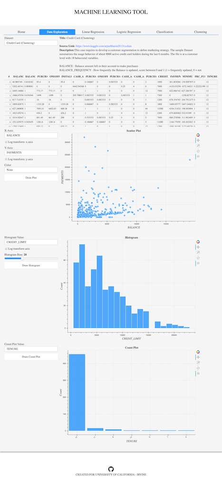

# 
 Machine Learning Tool 

- This is a tool to get hands-on experience with Machine Learning concepts like Regression, Classification, Clustering.
- There are pre-loaded datasets (open-source) available within each section of the application (**Note:** Adding custom datasets could a future update).
- Source of the sample datasets are mentioned in the `Data Exploration` tab within the application or can be found in the [Data sources](Data/data_sources.csv) file.
- The tool was built to make it as a medium to get hands-on visual experience to different aspect of data science like exploring/visualizing different data types, building models to make predictions, evaluating the models.
- **Note:** At this point, model optimization/selection is not an option since datasets are pre-built. This could be implemented as a future update.
- **Disclaimer:** As a data scientist, this is not the `only` way to learn/practice data science concepts. For someone with relatively less experience in coding/data-science concepts, this is a method to facilitate interest and give a brief idea about the concepts.

---

## Core components of the tool

[main.py](main.py) - Core code which builds the application. The application is built using [Bokeh](https://docs.bokeh.org/en/latest/) and uses other packages like [Scikit-Learn](https://scikit-learn.org/stable/) for Machine Learning.

[data_sources.py](data_sources.py) - Load the text for each open source dataset. The text is used to populate the `data source` section in the `Data Exploration` tab within the application. 

[regression.py](regression.py) - performs the necessary calculations for `Linear Regression`.

[logistic_regression.py](logistic_regression.py) - performs the necessary calculations for `Logistic Regression`.

[classification.py](classification.py) - performs the necessary calculations for `Classification (Multi-class)`.

[clustering.py](clustering.py) - performs the necessary calculations for `Clustering`.

[styles.css](templates/styles.css) - CSS file for custom modifications to Bokeh widgets, plots and few other Bokeh objects. (**Note:** Lot of customization were done and could result in different effect on different browsers)

---

## Inside the application

There are 5 sections in the application, excluding the `Introduction` section.

- `Data Exploration:`

    - All the sample datasets are available to use in this section.
    - The data sources (link to the source), description and the feature significances are explained here.
    - The data, once selected, is loaded on the table in order to be viewed. This is done across all the sections.
    - Once that is completed, there are 3 graphs that can be created in this page. 
        - `Scatter plot:` Create scatter plot between 2 continous variables. (**Note:** Details about how dataset is filtered automatically for continous, discrete/categorical values are explained at a later stage)
        - `Histogram plot:` Create histogram plots for continous variables. The number of bins can be changed.
        - `Count plot:` Create count plot for categorical/discrete variables. (**Note:** Only variables with `<=20` unique values can be plotted here. The length was fixed just to keep the plotting look efficient).

- `Linear Regression:`

    - Correlation matrix is plotted on this page.
    - All the features in the dataset are populated in the `select features` and can be selected as the features for the regression model
    - The data could be kept as the source data or could be normalized (The algorithms/packages used for normalization are explained later).
    - Only the continous variables are populated in the `select target` options.
    - The model can be evaluated using `Actual vs Predicted values` plot, `Residual vs Predicted Value` plot.
    - The `R^2, Mean Absolute Error (MAE) and Root Mean Square Error (RMSE)` are displayed for model evaluation.

- `Logistic Regression:`

    - `Classification Report` is generated in this page along with `Confusion Matrix` and `ROC Curve`.
    Since this is a logistic regression, the variables which has only binary values are populated in the target variable dropdown. 
    - For multi-class problems, classification tab should be used.

- `Classification:`

    - Uses `Random Forest` for classifying multi-classes.
    - In the target dropdown, only discrete/categorical variables are shown.
    - Along with `Classification Report` and `Confusion Matrix`, `Feature Importance` is plotted.

- `Clustering:`

    - `K-Means` clustering is used.
    - `Optimal clusters` and `silhouette score` are calculated.
    - Number of clusters can also be changed and visualized using `t-distributed Stochastic Neighbor Embedding (TSNE)`.

---

## Sample dashboard

Exploration |  Logistic Regression
:-------------------------:|:-------------------------:
  |   

---

## Credits

Developer - Samira Kumar ([@SamiraK93](https://twitter.com/Samirak93))

---

## License

MIT License

Copyright (c) 2019 Samira Kumar Varadharajan

Permission is hereby granted, free of charge, to any person obtaining a copy
of this software and associated documentation files (the "Software"), to deal
in the Software without restriction, including without limitation the rights
to use, copy, modify, merge, publish, distribute, sublicense, and/or sell
copies of the Software, and to permit persons to whom the Software is
furnished to do so, subject to the following conditions:

The above copyright notice and this permission notice shall be included in all
copies or substantial portions of the Software.

THE SOFTWARE IS PROVIDED "AS IS", WITHOUT WARRANTY OF ANY KIND, EXPRESS OR
IMPLIED, INCLUDING BUT NOT LIMITED TO THE WARRANTIES OF MERCHANTABILITY,
FITNESS FOR A PARTICULAR PURPOSE AND NONINFRINGEMENT. IN NO EVENT SHALL THE
AUTHORS OR COPYRIGHT HOLDERS BE LIABLE FOR ANY CLAIM, DAMAGES OR OTHER
LIABILITY, WHETHER IN AN ACTION OF CONTRACT, TORT OR OTHERWISE, ARISING FROM,
OUT OF OR IN CONNECTION WITH THE SOFTWARE OR THE USE OR OTHER DEALINGS IN THE
SOFTWARE.